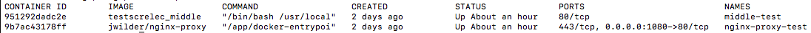
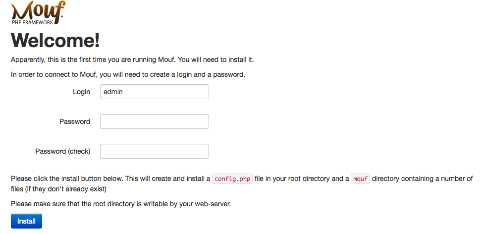
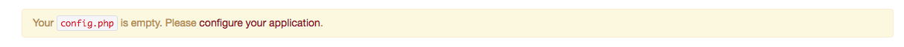
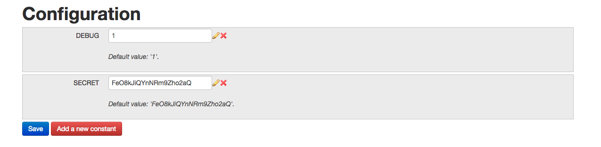
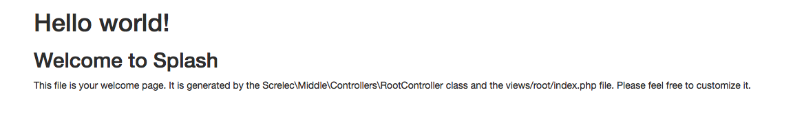
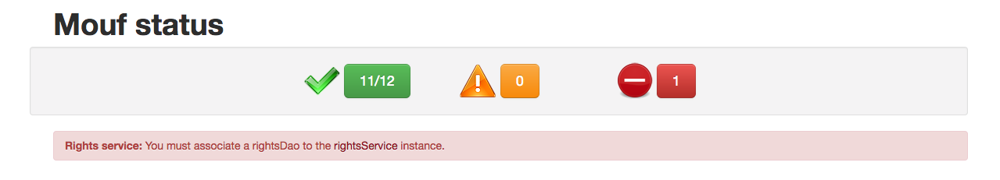
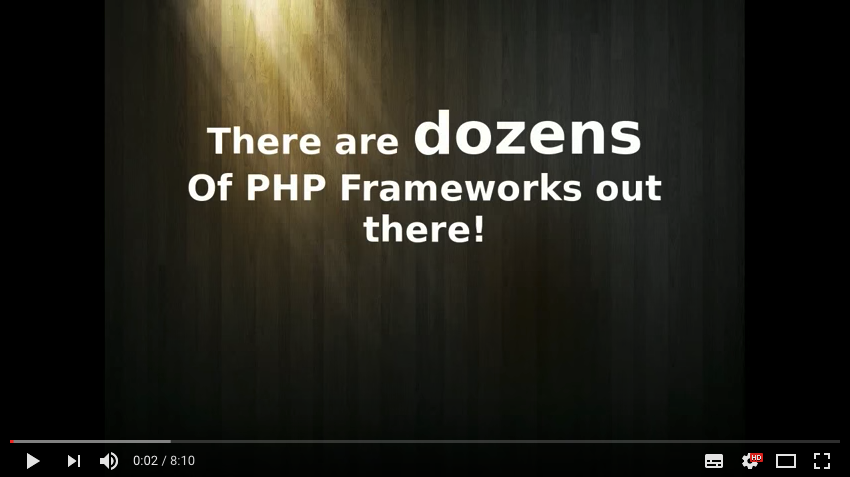

# Hello, welcome to the test

Your mission is to finish that exercise in One day.
If you finish you win 100$ and we recontact to you for more components.

## SKILL
To achieve this test, you will need basic skills in :
#### FrontEnd (JavaScript)
In this project the FrontEnd use **VueJs** technology (JavaScript). You can check the documentation in
#### BackEnd (PHP)
Moreover, which is quite important to us, you will also need to e skilled in discovering and learning Mouf. No worries, there is plenty of documentation to help you install the framework, and to teach you how to use the 2 main packages required to code this example :
*  **Using the MVC package (Splash):** [http://mouf-php.com/packages/mouf/mvc.splash/version/8.0-dev/README.md](http://mouf-php.com/packages/mouf/mvc.splash/version/8.0-dev/README.md)

## Intall

### Docker


Guide docker <https://www.docker.com/>

The project run with containers docker.

You can update you host to access at the container docker with your navigator.
Add `middle.screlec.dev` in your host (/etc/host) to access middle container docker.
 > 127.0.0.1 project.test.dev

Once project has clone :
* create containers : `docker-compose build`.
* lunch containers : `docker-compose up`
* stop conteiner : `docker-compose stop`.

*You can check the documentation for more informations.*

You can check your container with command :

> check your containers in running : `docker ps`

You must to have the container thereafter



### Composer

composer guide : https://getcomposer.org/

You must to go in container middle-test command:
> docker exec -ti middle-test bash

In the racine of project you con execute the command composer :
>php composer.phar install

or

>composer install

Nice, you download components of Mouf Framework

### Install Mouf


Once the download of components Mouf Framework finished. You must to go at:

> http://middle.test.dev:1080/vendor/mouf/mouf



Add the name and password, example : (admin,admin)



You must to be configure **Mouf** framework.



Save the configurations

Nice your project is installed. You can go to http://middle.test.dev:1080/ , you should see :



You can check the status of Framework Mouf on Mouf Home page : (http://project.test.dev:1080/vendor/mouf/mouf/).



Also, if you take a look to the project's files, you will see, among others, the following files:

* **middle** *field of back container*
  * **src** *your php classes are here*
    * **Controllers** *controllers should be placed here*
      * **RootController**.php
    * **Font** *files vueJs*
  * **views** *store the VIEWS called by your Controllers*
    * **root**
      * **index.twig** *the view called to display the Splash welcome screen*
* **nginx** *proxy of reverse proxy server for HTTP, HTTPS, SMTP, POP3, and IMAP*
* **img** *picture readme and specification*
* **docker** *docker file and configuration*
* **docker-compose.yml** *file for docker-compose*

documentation Mouf Framework:

[](http://mouf-php.com/packages/mouf/mouf/doc/installing_mouf.md)

## Install vueJs

The front with **VueJs** is a field `src/front`.

```
> npm install
```
VueJs, vue-router, webpack... is installed.

We can use Webpack or other technologies, It's like you want :)

# What you should achieve

## Test Project

Basically, we want to implement 2 function in controller :
* save user : save user *(you can use class UserBean)*
* get user : return JSON list of users

we want to implement 2 screens :
* user form : add user
* user view : user informations.

### Your Job Back :

So you can develop an function to receive data send from a form in the Front container. You can create a URL in controller `@URL("/testformulaire")`. This URL contains parameters sent from the form `@param string name`. And so you can declare the method HTTP to receive your data with URL, for example : `@Get()`or`@Post()`...

You can see an example thereafter

 in `src/Controllers/RootController.php`
```php
	/**
     *
     * @URL("/opportunity/save")
     * @Post
     *
     *
     * @param int $opportunityId
     * ...
     */

     public function testFormulaire(int $opportunityId){
        ...
     }
```

This function `testFormulaire` is linked with URL  `"/opportunity/save"` and wait one parameter : `$opportunityId`

* `@RUL("...")` define URL
* `@param` define param in HTTP request
* `@Post()` or `@Get()` define HTTP method of this URL

You can check your URL defined in mouf  :
* http://middle.test.dev:1080/vendor/mouf/mouf/splashViewUrls/
* MVC -> Splash -> View URLs

### Your Job front :

You must write a single page apps using:
- Vuejs
- Vuex
- Vue-router

This app should allow to :
- List all user
- Add a new user

The page should not refresh between calls, there must be validation (using a random library or a custom validation), and new elements should be displayed inside the list.

You can use our skeleton, it use webpack for dependency management. Feel free to watch the config file, some aliases has been created.
You can aswell use another method.

##### Job form


You must to create form with next informations :
>- LastName
>- FirtName
>- Mail
>- Phone
>- Country
>- ...

**Rules** in JavaScript :
* Mail is not null and correct
* LastName is not null
* FirstName is not null
* Phone < 12 numbers

##### Job view


The view must have information of previous creating user :
>- LastName
>- FirtName
>- Mail
>- Phone
>- Country
>- ...

You have **one day** for this Work. If you have a problem or error, you can contact me.

When you finish, send me your data with pull request in repository GitHub : https://github.com/gparant/test.screlec. I analyse your work and I give you feedback.

**The test creates yours develop environment and evaluates your competencies for the project. If you are up to it, you will gain much more thereafter ... Good luck and, above all, have fun! **
